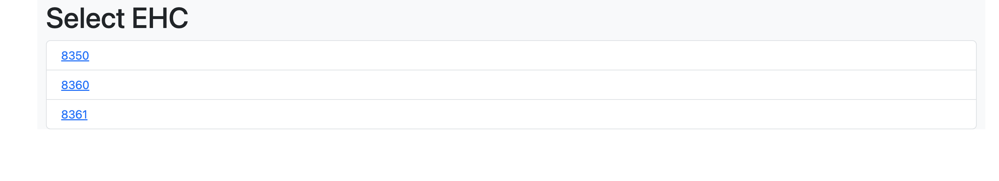
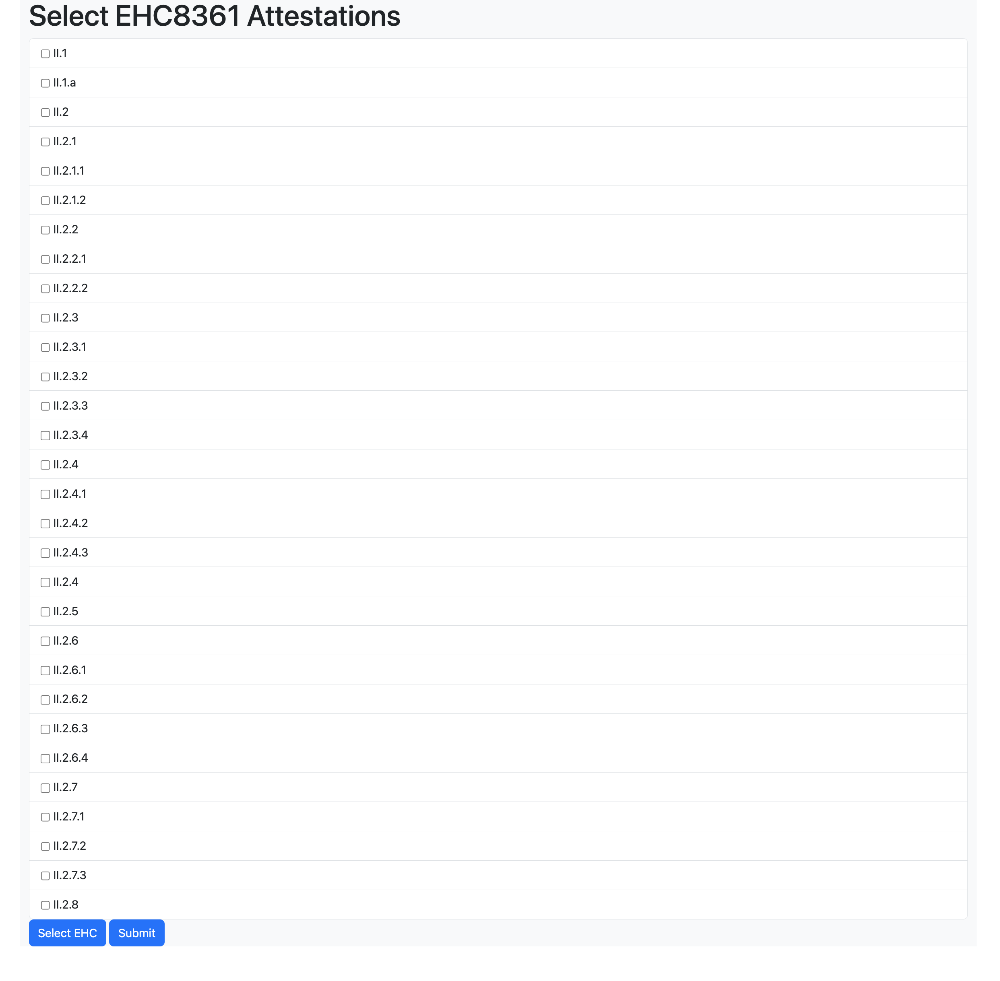
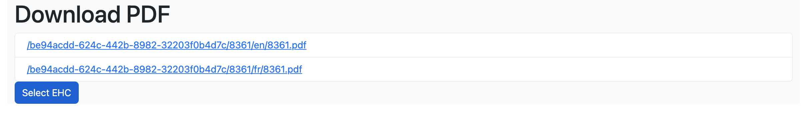
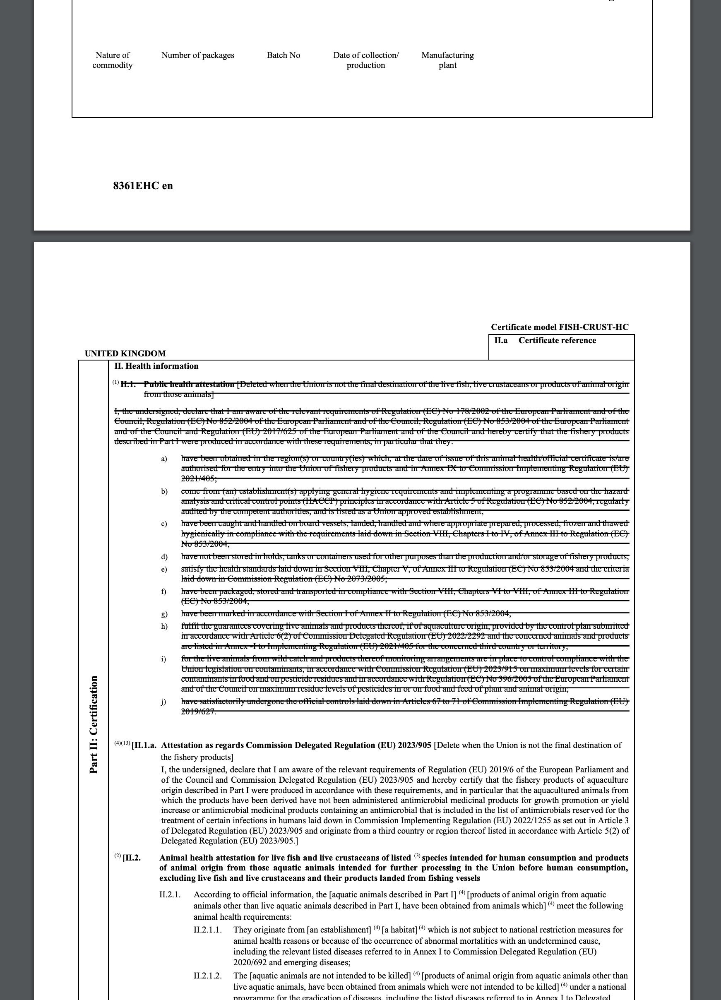

# Attestation Strike Through Demo

## Description

Application demonstrating the ability index EHC certificate documents to extract attestation metadata and strike through selected attestations on PDF documents.

### Project Walkthrough

On startup, the project will index any pdf documents found in the `ehc` directory, creating a json metadata document corresponding to each pdf in the `data` directory.

(note. the index process can also be kicked off by accessing the following url http://localhost:3000/index)

Accessing http://localhost:3000/ will then present a html page allowing the user to select from a list of indexed EHCs.



Selecting one of these will present a list of attestations extracted from the document.



Clicking `Submit` will then generate a pdf document (one for each language available) with the selected attestations scored out. The user will then be presented with a list of links to the generated PDFs.



Selecting one of the links will open the document.



Note. The indexing code is far from perfect. Though it works for certain EHC documents it will require much more work to handle the full list of EHC documents. This code exists to simply prove out what is possible.

## Project setup

```bash
$ npm install
```

## Compile and run the project

```bash
# development
$ npm run start

# watch mode
$ npm run start:dev

# production mode
$ npm run start:prod
```

